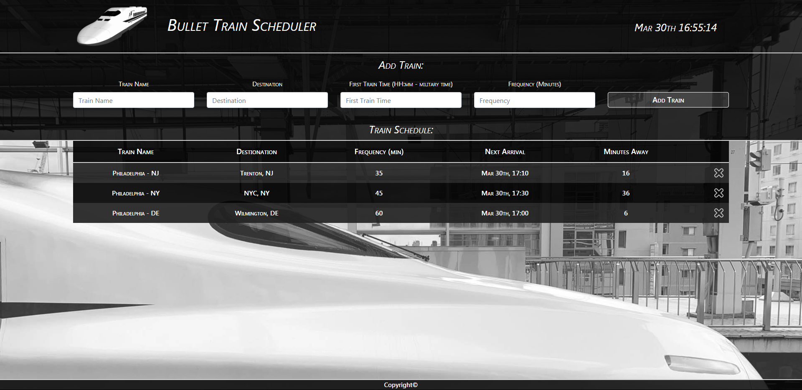

# Train-Scheduler
**Firebase Assignment - Train Scheduler**

A dynamic web page that alows you to **Add Trains** to **Schedule Board**. Insert **Train Information** such as **Train Name**, **Destination**, **First Train Time**, **Frequency** and **Train Scheduler** will calculate for you **Next Arrival Time**, **Minutes Away** and add it to the board. Added **Delete** if your train is o longer available. All data stored at **Firebase**

Link to Github Deployment

https://yuriyhorbatenko.github.io/Train-Scheduler/

Languages & Technologies used
HTML, CSS, Firebase, Javascript, Jquery
